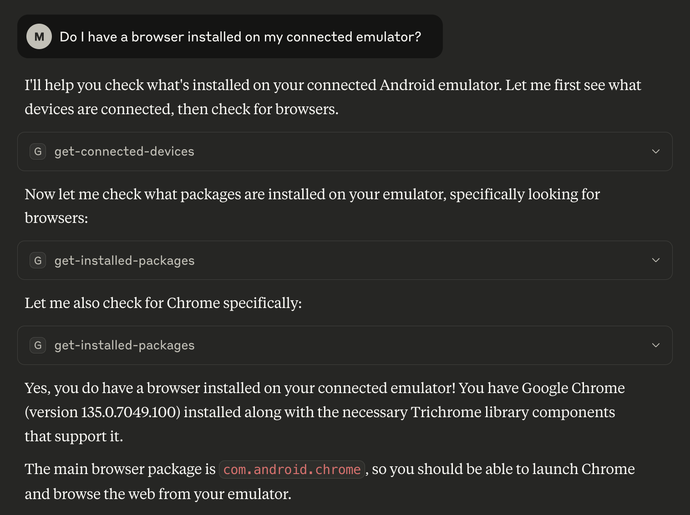

# ADB Friend

ADB Friend is a tiny cli tool, which helps you to manage your Android device via ADB.
Its features were mostly designed for developers, but it can be useful for everyone.

## Features

- Sync files from your computer to your phone
    - Designed for test data, skipping existing files on device
- Configure device for tests
    - Disable animations, Enable touches, ...
- Uninstall apps by pattern
- Packages command
    - Apply the immersive flag to all packages matching glob, force-stop, clear app data & cache
- Extra tools
    - adb-speed (Helps to identify sub-par cables)
- Model Context Protocol [MCP](https://modelcontextprotocol.io/) Server

## Install

The installation can be performed using Homebrew. First you'll require the custom tap:

```bash
brew tap mikepenz/tap
```

Next, install the AdbFriend CLI:

```bash
brew install mikepenz/tap/adbfriend
```

Alternatively, you can download prebuild binaries for release page.

## Usage

ADB Friend is a command line tool, which can be used in a terminal.

```bash
# Get started with the `--help` command, to get information and an overview on the various features offered.
adbfriend --help
```

## MCP Server

ADB Friend (Since version 1.4.0) also provides
a [Model Context Protocol (MCP) Server](https://modelcontextprotocol.io/introduction), that can be configured in popular
AI Tools
like [Claude Desktop](https://modelcontextprotocol.io/quickstart/user), [GitHub Copilot](https://docs.github.com/en/copilot/customizing-copilot/extending-copilot-chat-with-mcp), [RayCast](https://manual.raycast.com/model-context-protocol), ...

### Configuration

The location and details of the configuration file will depend on the used tool. Below example
for [Claude Desktop](https://modelcontextprotocol.io/quickstart/user#2-add-the-filesystem-mcp-server).

```json
{
  "mcpServers": {
    "adb-friend": {
      "command": "/opt/homebrew/bin/adbfriend",
      "args": [
        "mcp",
        "server"
      ],
      "env": {
        "ANDROID_HOME": "/Users/mikepenz/Development/android/sdk"
      }
    }
  }
}
```

> [!IMPORTANT]  
> If `ANDROID_HOME` is not provided, the `adb-server` has to be manually started on your machine.
> Otherwise, a connection exception is thrown.

### Debug Server

You can use the `npx @modelcontextprotocol/inspector` to debug the server once started.

```bash
# Install and run inspector in your terminal
npx @modelcontextprotocol/inspector
```

Then launch the website (with the url as provided in the terminal).
Launch the `mcp server` using IntelliJ or the actual command.

```bash
# Default port is `3001`
adbfriend mcp server --sse true
```

### Supported tools

| Tool Name                      | Description                                                                                               |
|--------------------------------|-----------------------------------------------------------------------------------------------------------|
| check-adb-speed                | Checks the USB connection speed of an Android device for the provided serial.                             |
| clear-installed-package        | Clears the package data for provided package names on an Android device.                                  |
| set-immersive-full-for-package | Sets the 'immersive-full' flag for provided package names on an Android device.                           |
| force-stop-process             | Forces the stop of provided package names on an Android device.                                           |
| uninstall-package              | Uninstalls provided package names on an Android device.                                                   |
| get-connected-devices          | Retrieves information about all connected Android devices including serial, model, and state.             |
| get-installed-packages         | Retrieves information about all installed packages on an Android device.                                  |
| list_allowed_directories       | Lists directories that are allowed to be accessed by the file system tools.                               |
| list-files                     | Lists files and directories on an Android device. Supports recursive listing with the 'recursive' option. |
| read-file                      | Reads the content of a file on an Android device.                                                         |
| read_multiple_files            | Reads the contents of multiple files on an Android device at once (reduces LLM calls).                    |
| write-file                     | Writes content to a file on an Android device.                                                            |
| create-directory               | Creates a directory on an Android device.                                                                 |
| delete                         | Deletes a file or directory on an Android device.                                                         |
| search-files                   | Searches for files matching a case-insensitive glob pattern within allowed directories.                   |
| move_file                      | Moves a file from the source path to the destination path on an Android device.                           |
| capture-screenshot             | Captures a screenshot from an Android device and saves it to the host system.                             |

With many more tools planned for the future.

### Example Prompts

```text
uninstall the 'sample' app, but keep its data
```

```text
force stop the 'sample' app
```

```text
Do I have a browser installed on the connected emulator?
```



## Release

The project uses shadow to package the tool in a fat-jar, and also do minimal minification.

```bash
./gradlew adbfriend-cli:shadowDistZip
```

## Other

### AboutLibraries

## Generate `aboutlibraries.json` for `adbfriend`

```bash
./gradlew adbfriend:exportLibraryDefinitions
```

## Generate `aboutlibraries.json` for `adbfriend-cli`

```bash
./gradlew adbfriend-cli:exportLibraryDefinitions
```

### Credits

This project uses the amazing [adam](https://github.com/Malinskiy/adam) library
from [Malinskiy](https://github.com/Malinskiy) to interact with `adb`.
The CLI is set-up using the impressive [clikt](https://github.com/ajalt/clikt) library
from [ajalt](https://github.com/ajalt/).

### License

```
Copyright 2025 Mike Penz

Licensed under the Apache License, Version 2.0 (the "License");
you may not use this file except in compliance with the License.
You may obtain a copy of the License at

    https://www.apache.org/licenses/LICENSE-2.0

Unless required by applicable law or agreed to in writing, software
distributed under the License is distributed on an "AS IS" BASIS,
WITHOUT WARRANTIES OR CONDITIONS OF ANY KIND, either express or implied.
See the License for the specific language governing permissions and
limitations under the License.
```
